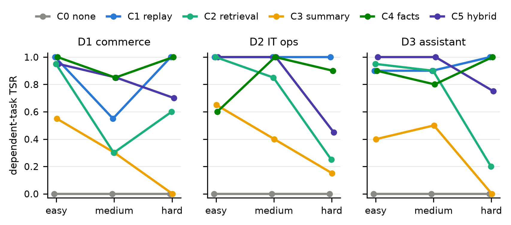
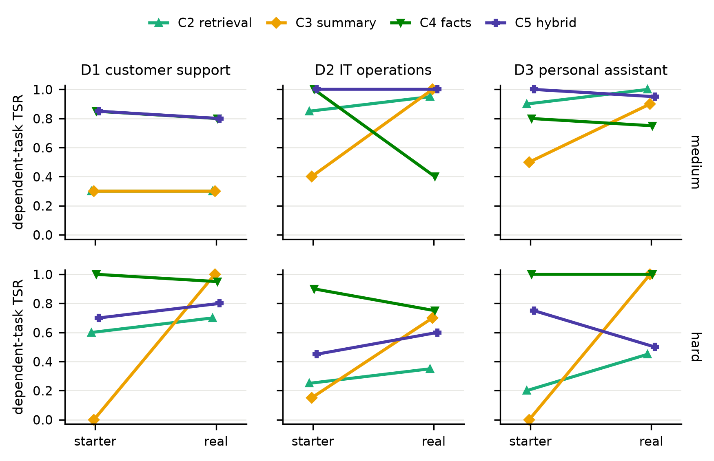
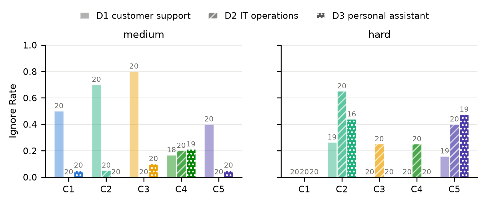
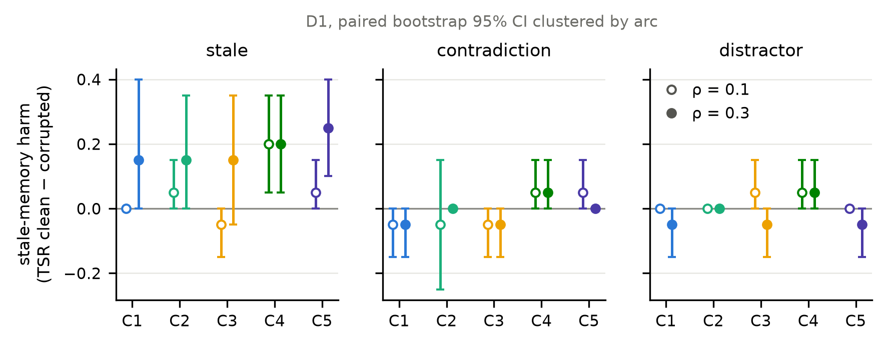
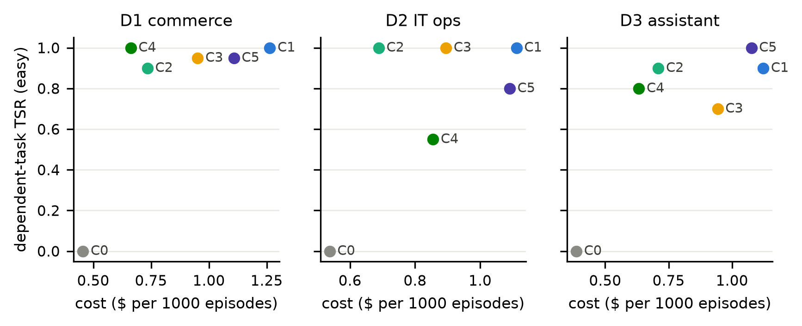
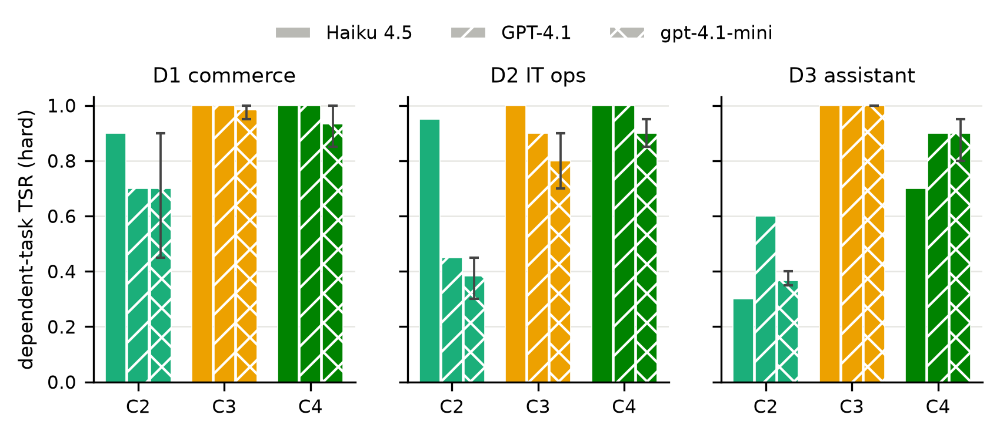

# When Does Memory Help? A Cost-Aware Evaluation of Long-Term Memory in Tool-Using LLM Agents

**Shweta Mishra** · **Shashank Mishra**
*Independent Research*

> **STATUS: arXiv preprint draft v1.1 (2026-07-12).** All numbers in §5 are
> real measured results: a two-generation pilot (9,940 scored episodes,
> gpt-4.1-mini) — starter memory implementations, then real ones (embedding
> retrieval, LLM summarization, LLM extraction) on the identical grid —
> followed by the preregistered full grid (§5.7): 3 agent models × 3 domains
> × 3 difficulty tiers with 3 seeds on the primary model, 13,500 further
> episodes. Pilot and full grid: 23,440 scored episodes, $44.82 in API
> cost; latest-generation and frontier spot-checks (Claude Sonnet 5, Opus
> 4.8) are reported separately as diagnostics in §7.

---

## Abstract

Long-term memory is widely assumed to improve the performance of LLM-based
agents, and a rapidly growing ecosystem of memory systems — retrieval-
augmented stores, rolling summarization, and structured fact memories — now
competes on conversational recall benchmarks such as LoCoMo and LongMemEval.
These benchmarks measure *question answering over dialogue history*, not the
setting where memory is most consequential in production: **tool-using agents
executing multi-step tasks across sessions**. We present **MERIT** (Memory
Evaluation for Realistic Instrumented Tasks), a benchmark and evaluation
harness that measures the *marginal utility* of memory for task-executing
agents under explicit cost accounting. MERIT provides (i) episodic tool-use
tasks in three domains where a controllable fraction of episodes depend on
facts established in earlier episodes, verified non-re-derivable by an
automated leak check; (ii) a three-tier **difficulty ladder** — single-fact,
multi-fact, and *updated-fact* recall; (iii) controlled **memory corruption**
(stale, contradiction, distractor); and (iv) full token and dollar accounting
for every memory operation. In a two-generation pilot (6 memory conditions ×
3 domains × 3 difficulty tiers, run first with starter implementations and
then with real ones — embedding retrieval, LLM summarization, LLM extraction
— 9,940 scored episodes, gpt-4.1-mini), memory conditions lift dependent-task
success from a leak-verified floor of 0.00 (no memory) to 0.55–1.00 (all
Holm-adjusted p ≤ 0.001). The tiers dissociate architectures sharply: when a
remembered fact is *updated* mid-arc, embedding retrieval collapses (success
0.35–0.70; the agent acts on the correct value only 55% of the times that
value is retrieved), while stores that overwrite — a structured fact store
with update-on-write semantics, and, notably, LLM summarization, which
rewrites its summary each episode — reach 0.70–1.00; the *hybrid* of fact
store and retrieval is worse than the fact store alone in all three domains
(0.50–0.80). The implementation swap is itself diagnostic: LLM summarization
rescues the summary condition on updated facts (0.00–0.15 → 0.70–1.00),
while swapping pattern extraction for LLM extraction *costs* the fact store
up to 60 points in one domain — implementation quality is a first-class
variable, and MERIT measures it. A three-model replication (gpt-4.1-mini ×
3 seeds, GPT-4.1, Claude Haiku 4.5; 13,500 further episodes, memory side
held fixed) sharpens the headline: the updated-fact collapse of embedding
retrieval is real but *unreliable* — which domains it strikes varies by
agent model (hard-tier success 0.30–0.95) and by seed (max pairwise seed
gap 0.45, the largest of any condition) — while LLM summarization stays at
0.80–1.00 on the hard tier across every model, domain, and seed. A
latest-generation spot-check on Claude Sonnet 5 (2026), gated on a clean
full-replay control, reproduces the hard-tier pattern (embedding retrieval
0.75 vs. update-on-write memories 1.00). Under explicit cost accounting with
memory-side calls metered, full replay is never the economical choice: the
best condition per domain delivers 2.7–3.9× its marginal utility per dollar.
We release the benchmark, harness, and all traces for reproducible,
cost-aware comparison of agent memory systems.

**Keywords:** LLM agents, long-term memory, benchmark, evaluation, tool use,
cost analysis

---

## 1. Introduction

LLM-based agents that plan, call tools, and act over multiple sessions are
moving rapidly into production — customer support, IT operations, coding, and
personal assistance. A central architectural question for every such
deployment is whether and how to give the agent *long-term memory*:
information persisted across sessions and selectively recalled. A vibrant
ecosystem of memory systems has emerged (Mem0, Letta/MemGPT-style OS
memories, Zep, LangGraph checkpointing, bespoke RAG stores), and vendors
compete on recall benchmarks.

Yet the evaluation of agent memory has three blind spots:

**Blind spot 1: Conversational QA is not task execution.** The dominant
benchmarks — LoCoMo (Maharana et al., 2024), LongMemEval (Wu et al., 2025),
and BEAM (Tavakoli et al., 2025) — test whether a system can answer questions
about long, multi-session *conversations*. Production agents, by contrast,
must use remembered facts to *choose the correct tool call*: the right
customer ID, the previously agreed refund amount, the configuration fix
identified during last week's incident. Whether conversational recall scores
transfer to task-execution utility is an open empirical question.

**Blind spot 2: Memory is assumed to help; harm is unmeasured.** Recent work
notes that agents sometimes ignore retrieved memory records or use them
inconsistently, and HaluMem (2025) examines memory hallucination and
consistency — but in conversational settings. In task execution, a stale
memory (a customer's *old* address, a rolled-back configuration) is not just
unhelpful; it produces a *confidently wrong action*. No existing benchmark
quantifies this failure mode under controlled corruption, nor the more basic
failure our pilot surfaces: agents that demonstrably hold the correct fact in
context and still do not act on it (Ignore Rate 0.45–0.53 across
implementations).

**Blind spot 3: Cost is reported, but marginal utility is not.** Memory
systems report token counts alongside accuracy, but the decision
practitioners face is economic: does adding memory raise task success enough
to justify its per-task cost? We are not aware of any evaluation that reports
*cost-adjusted marginal utility* — the change in success probability per
marginal dollar — across memory architectures.

We address all three with **MERIT**. Our contributions:

1. **A task suite with controllable memory dependency and difficulty.**
   Episodic tool-use tasks in three domains (customer support, IT operations,
   personal assistant) where a tunable fraction of episodes depend on facts
   established in earlier episodes, and a three-tier difficulty ladder:
   *easy* (one fact), *medium* (multiple facts must be composed), *hard* (the
   fact is updated mid-arc and the latest value is required). An automated
   **leak check** verifies at generation time that no gold fact is present in
   the probe episode's inputs or re-derivable from tools.
2. **Controlled memory corruption.** Stale, contradictory, and distractor
   records injected at known rates ρ, with ground-truth flags, to measure
   Stale-Memory Harm.
3. **Three metrics absent from prior evaluations**: Memory Utilization Rate
   (MUR), Ignore Rate, and Cost-Adjusted Marginal Utility (CAMU), computed
   automatically by the harness (§3.5).
4. **A two-generation pilot study** of 6 memory conditions × 3 domains × 3
   difficulty tiers (9,940 scored episodes) — the full grid run twice, with
   starter implementations and with real ones — with preregistered hypotheses
   and statistics (paired bootstrap clustered by arc; Holm–Bonferroni),
   demonstrating that the benchmark separates memory architectures that are
   indistinguishable under single-fact recall, and separates *architecture*
   from *implementation quality* — plus a 3-agent-model × 3-seed replication
   (13,500 further episodes, §5.7) showing the updated-fact collapse of
   embedding retrieval is model- and seed-unstable while update-on-write
   memories are uniformly robust.
5. **Open-source release** of the benchmark, harness, and all traces, with a
   deterministic $0 mock-model mode that validates the full pipeline.

## 2. Related Work

### 2.1 Memory systems for LLM agents

MemGPT (Packer et al., 2023) frames memory as an OS-style hierarchy with the
LLM paging information in and out of context. Mem0 (Chhikara et al., 2025)
extracts and consolidates structured facts at write time; Zep (Rasmussen et
al., 2025) maintains a temporal knowledge graph; A-Mem (Xu et al., 2025)
organizes agentic notes dynamically. Rolling summarization is the default
pattern in agent frameworks such as LangChain/LangGraph. These systems papers
evaluate primarily on conversational QA (LoCoMo, LongMemEval); none evaluate
task-execution utility under cost accounting. MERIT's conditions C1–C5 are
deliberately *reimplementations of these architecture families* under one
interface, so that architectural mechanisms (retrieval, summarization,
update-on-write, hybrid) can be compared in isolation from product
engineering.

### 2.2 Benchmarks for agent memory

LoCoMo (Maharana et al., 2024) evaluates QA over very long multi-session
dialogues. LongMemEval (Wu et al., 2025) covers information extraction,
multi-session reasoning, temporal reasoning, knowledge updates, and
abstention over ~115K-token histories. BEAM (Tavakoli et al., 2025) scales
conversational probing to 10M tokens. HaluMem (2025) evaluates hallucination
at the level of memory operations (extraction, updating, QA). RealMem
(Bian et al., 2026) moves toward project-oriented interaction. All are *answer-producing*
evaluations; MERIT is *action-producing*: success is a predicate over the
final state of a mutable world, and the knowledge-update dimension that
LongMemEval and HaluMem probe conversationally becomes, in MERIT's hard tier,
a behavioral test of whether the agent *acts* on the latest value. Long-
context benchmarks (RULER, Hsieh et al., 2024; BABILong, Kuratov et al.,
2024) test single-pass attention over a given context, not the write-and-
retrieve loop of a persistent memory.

### 2.3 Tool-use and agent benchmarks

τ-bench (Yao et al., 2024) evaluates tool-calling agents conversing with
simulated users over domain APIs with database-state success checks — the
closest environment design to MERIT's — but each task is a single episode;
memory across episodes is not exercised. AgentBench (Liu et al., 2023),
SWE-bench (Jimenez et al., 2024), and WebArena (Zhou et al., 2023) similarly
evaluate within-episode competence. MERIT adds the cross-episode dependency
structure (arcs, plants, probes, leak check) on top of a τ-bench-style
environment.

### 2.4 Reliability of agents

Production reports consistently rank reliability as the top barrier to agent
deployment; confidently-wrong actions are costlier than abstentions. Stale-
memory harm is a concrete, measurable instance: MERIT injects staleness at
known rates and measures both the success drop and whether the agent
re-verifies before acting.

## 3. The MERIT Benchmark

### 3.1 Design goals

G1 (Ecological validity): tasks require tool calls with programmatically
verifiable end states. G2 (Controllable dependency and difficulty): the
dependent-task ratio and the difficulty tier are benchmark parameters. G3
(Adversarial realism): corruption reflects real staleness processes. G4 (Cost
transparency): every token in and out of the memory system is metered. G5
(Reproducibility): deterministic seeded worlds, scripted or cached simulated
users, pinned model versions, released traces, and a $0 deterministic mock
model that exercises the entire pipeline.

### 3.2 Environment

An **episode** is one agent session with a simulated user and a tool API over
a mutable world state (SQLite). Episodes are grouped into **arcs** of 4–6
episodes sharing entities. Arcs contain **plant** episodes (a fact is
established conversationally; the user explicitly forbids acting on it yet),
optional **update** episodes (the fact is revised), **probe** episodes
(success requires the fact; it is absent from the episode's inputs), and
**independent** episodes (solvable within-episode).

Two safeguards proved essential in practice. The **leak check** asserts at
generation time that every gold fact value is absent from the probe episode's
inputs and from the initial world state, with gold values kept unique
arc-wide. **Delta scoring** marks an episode successful only if its checker
predicate flips from false to true *during* that episode — in early gate
runs, eager agents processed refunds during plant episodes, and probes then
"succeeded" off inherited world state; delta scoring eliminates this world-
state leak channel entirely (across 9,940 episodes, the 6 probes that
arrived with their checker already satisfied score as failures, never as
inherited successes).

### 3.3 Domains

- **D1 Customer support (retail):** tools = get_order, refund,
  update_address, get_policy, send_message. Facts: agreed partial-refund
  amounts, updated addresses.
- **D2 IT operations:** tools = search_logs, get_deploy_history, get_config,
  set_config, deploy, update_ticket. Facts: diagnosed config fixes, safe
  rollback versions.
- **D3 Personal assistant:** tools = get_calendar, create_event, send_email,
  get_preference, set_preference. Facts: standing room/time preferences,
  dinner commitments (place, day, time).

### 3.4 Difficulty ladder and memory conditions

**Difficulty**: *easy* = one gold fact per probe; *medium* = multi-fact
probes (every gold value must appear in the executed tool calls); *hard* =
updated-fact probes: the value is planted, revised in a later episode, and
the probe requires the **latest** value. The hard tier is a targeted stressor
for the architectural distinction between stores that overwrite
(update-on-write) and stores that accumulate (replay, retrieval).

**Memory conditions**, one interface (`write(episode)`, `read(context)`):
C0 none; C1 full replay of prior transcripts; C2 retrieval (starter:
keyword-overlap; real: embedding retrieval, text-embedding-3-small); C3
rolling summary (starter: extractive truncation; real: LLM summarization);
C4 structured fact store with update-on-write (starter: pattern-based
extraction; real: LLM extraction); C5 hybrid (C4 + C2). Each condition ran
in both an inexpensive **starter** implementation and a **real** one
(memory-side LLM/embedding calls, fully metered); the grid was run once per
generation (§5.3 compares them). All conditions share the same agent
scaffold (ReAct-style tool loop; Yao et al., 2023), prompts (except the
memory block), tools, and decoding (temperature 0).

### 3.5 Metrics

- **TSR**: task success rate by programmatic end-state check, split by
  dependent/independent.
- **MUR**: among dependent episodes where all gold values were present in the
  retrieved memory block, the fraction where every gold value appears in the
  executed tool-call arguments (value tracing). A frozen, stratified
  100-episode audit sample is committed to the repository. A human
  annotator labeled all 100 items blind to the tracer's output: the tracer
  agrees with human judgment on 93% of items (Cohen's κ = 0.63,
  substantial agreement). All seven disagreements are in the same
  direction, with the tracer scoring *not utilized* where the human judged
  the value was used, so the tracer under-counts utilization and the
  Ignore Rates we report are conservative upper bounds. Independent
  second-annotator labeling is left to future work.
- **Ignore Rate** = 1 − MUR on episodes with correct memory present.
- **SMH**: TSR(clean) − TSR(corrupted) at ρ ∈ {0.1, 0.3} for stale /
  contradiction / distractor corruption.
- **Cost & CAMU**: metered tokens and dollars per episode; CAMU = ΔTSR vs C0
  per Δcost vs C0; break-even task value = Δcost/ΔTSR.

### 3.6 Statistical methodology

Paired comparisons on identical task instances; 95% CIs and two-sided p by
paired bootstrap (10,000 resamples) clustered at the arc level;
Holm–Bonferroni within each preregistered hypothesis family (H1–H4,
committed to the public repository before experiments; commit history is the
preregistration record).

## 4. Experimental Setup

Model: gpt-4.1-mini (pinned; temperature 0) on both the agent side and, in
the real-implementation generation, the memory side (embeddings:
text-embedding-3-small). Scale per generation: 10 arcs × 5 episodes per
(domain × difficulty × condition); dependent-task ratio 0.5; corruption
sweep (3 modes × ρ ∈ {0.1, 0.3}) with LLM-paraphrased users on D1. Totals:
**9,940 scored episodes, $9.13 in API cost** — starter generation 5,440
episodes / $4.61, real generation 4,500 episodes / $4.52 (~$0.001/episode
including memory-side calls, which are metered into all cost figures).
Harness: Python, LiteLLM for provider-agnostic calls and metering; SQLite
worlds; scripted simulated users (LLM paraphrase mode with a paraphrase-leak
check on D1). The mock-model mode replays the entire grid deterministically
at $0 and is exercised by 62 unit tests, including generation determinism,
leak checks, and end-to-end pipeline invariants. Unless marked otherwise,
§5.1–5.6 report the real-implementation generation on gpt-4.1-mini.

**Full grid (§5.7).** The preregistered multi-model grid runs the real
implementations on three agent models — gpt-4.1-mini (3 seeds), GPT-4.1
(frontier, 1 seed), and Claude Haiku 4.5 (cross-vendor, pinned
`claude-haiku-4-5-20251001`, 1 seed) — over the identical 3-domain ×
3-tier grid, 10 arcs × 5 episodes per cell. The memory side is pinned to
gpt-4.1-mini (embeddings: text-embedding-3-small) for *every* agent model,
so the agent model is the only varying factor. Totals: **13,500 scored
episodes, $35.69** ($22.24 OpenAI + $13.45 Anthropic), bringing the study
to 23,440 episodes and $44.82 overall.

## 5. Results

### 5.1 Memory helps on dependent tasks; the floor is real

C0 scored **0.000** on dependent tasks in all nine (domain × difficulty)
cells, in both generations — the leak check holds; there is no route to the
gold facts except memory. On independent tasks C0 scores 0.83–1.00,
confirming task solvability. Every memory condition beats C0 on dependent
tasks in every domain at easy difficulty (ΔTSR +0.55 to +1.00; all
Holm-adjusted p ≤ 0.001, paired bootstrap clustered by arc).

### 5.2 The difficulty ladder dissociates architectures

Dependent-task TSR with real implementations (D1 / D2 / D3; Figure 1):

| Tier | C1 replay | C2 retrieval | C3 summary | C4 facts | C5 hybrid |
|---|---|---|---|---|---|
| easy | 1.00 / 1.00 / 0.90 | 0.90 / 1.00 / 0.90 | 0.95 / 1.00 / 0.70 | 1.00 / 0.55 / 0.80 | 0.95 / 0.80 / 1.00 |
| medium | 0.60 / 1.00 / 0.95 | 0.30 / 0.95 / 1.00 | 0.30 / 1.00 / 0.90 | 0.80 / 0.40 / 0.75 | 0.80 / 1.00 / 0.95 |
| hard | 1.00 / 0.95 / 1.00 | 0.70 / 0.35 / 0.45 | 1.00 / 0.70 / 1.00 | 0.95 / 0.75 / 1.00 | 0.80 / 0.60 / 0.50 |

*Figure 1: Dependent-task TSR across the difficulty ladder, per memory
condition and domain (real implementations). The hard (updated-fact) tier
separates memories that overwrite state — the fact store (C4) and, notably,
LLM summarization (C3), which rewrites its summary each episode — and
chronological replay (C1) from retrieval-based memories (C2, C5).*

Three dissociations: (1) **Updated facts break retrieval memory — including
embedding retrieval**: C2 falls to 0.35–0.70 on hard while C1 stays at
0.95–1.00 and C4 at 0.75–1.00 — retrieval surfaces stale and fresh values
side by side with no recency signal, while update-on-write overwrites and
replay resolves recency from chronology. (2) **Hybrid is worse than its
better half** on hard in all three domains (0.50–0.80 vs C4's 0.75–1.00):
the retrieval half re-imports the staleness the fact store had eliminated.
(3) **Full replay is update-immune but composition-limited**: C1 drops to
0.60 on D1-medium despite containing every fact — possessing information and
composing it are different capabilities. A fourth pattern emerged only with
real implementations: **LLM summarization behaves like update-on-write**
(1.00 / 0.70 / 1.00 on hard), because regenerating the summary each episode
naturally keeps the latest value — an architectural kinship invisible in the
starter generation (§5.3).

### 5.3 Starter vs real implementations: the swap is diagnostic

Upgrading C2–C5 in place, on the identical grid, moves conditions in both
directions (Figure 2):

- **C3 summary, truncation → LLM:** 0.00 / 0.15 / 0.00 → **1.00 / 0.70 /
  1.00** on hard. The starter result was a floor set by the implementation,
  not the architecture: truncation drops facts (starter MUR = 1.0 on the
  episodes it retained), while an LLM summarizer that rewrites state each
  episode is update-robust by construction.
- **C4 facts, patterns → LLM extraction:** D2 falls from 1.00 to **0.40** on
  medium (0.60 → 0.55 easy, 0.90 → 0.75 hard) while D1/D3 roughly hold. The
  hand-tuned patterns the starter needed per domain (§6) were not dead
  weight; the generic LLM extractor misses IT-ops facts they caught.
  Extraction quality is a real tax on structured memory, payable in either
  engineering effort or metered tokens — and now visible in the benchmark.
- **C2 retrieval, keyword → embedding:** modest gains everywhere (+0.10 to
  +0.25 on hard), but the hard-tier collapse persists — the failure is the
  architecture's missing recency arbitration, not retrieval quality.

The two generations bound an implementation-sensitivity band per
architecture; the band is wide (up to 1.00 TSR for C3 on updated facts),
which is itself an argument for action-level evaluation over memory-system
benchmarking.

*Figure 2: Dependent-task TSR, starter vs real implementation of each memory
condition (C2–C5), on the medium (top) and hard (bottom) tiers. LLM
summarization rescues C3 on updated facts; LLM extraction costs C4 up to 60
points in D2; embedding retrieval does not fix C2's hard-tier collapse.*

### 5.4 Agents ignore memories they hold

On the hard tier, pooling domains, the correct (latest) value was present in
C2's retrieved block in 55 probe episodes; the agent acted on it in 30
(**Ignore Rate 0.45**; 0.53 in the starter generation — upgrading retrieval
quality barely moves it). Even C1, whose memory block is a clean full
transcript, ignores up to 0.50 of held facts in multi-fact (medium-tier)
episodes (Figure 3). This is Blind spot 2 made measurable: memory-system
accuracy overstates end-task benefit unless utilization is measured.

*Figure 3: Ignore Rate — the fraction of dependent episodes where every gold
value was present in the memory block but the agent did not act on it — by
condition and domain on the medium and hard tiers (real implementations).
Numbers above bars are episode counts with memory present (bars at zero are
shown by their count only).*

### 5.5 Stale-memory harm

On D1 with stale corruption (Figure 4), the largest and only Holm-significant
harm is again on the hybrid C5 (SMH +0.25 at ρ=0.3, Holm-adjusted p=0.030) —
replicating the starter-generation result with real implementations. One
shift is instructive: C4 with LLM extraction shows stale harm of +0.20 (raw
p=0.013, not surviving Holm) where regex-C4's harm was ≤0.05 — the LLM
extractor ingests corrupted records that the rigid patterns rejected, another
face of the extraction-quality tax (§5.3). Contradiction and distractor
corruption produce small, non-significant effects at pilot scale.

*Figure 4: Stale-memory harm (TSR clean − corrupted, dependent tasks, D1,
real implementations) by condition, corruption mode, and corruption rate ρ;
error bars are paired bootstrap 95% CIs clustered by arc.*
(Corruption sweeps beyond D1, with verification-rate analysis, are left
to future work.)

### 5.6 Cost and marginal utility

With memory-side calls metered, per-episode cost on D1-easy (Figure 5): C0
$0.00046, C4 $0.00066, C2 $0.00073, C3 $0.00095, C5 $0.00111, C1 $0.00126
(2,914 tokens/episode — 2.7× C0's cost). CAMU and accuracy rankings differ
in every domain (H4 supported): the best CAMU is C4 in D1 (4,839 points of
dependent-task success per marginal dollar) and D3 (3,245), but **C2 in D2**
(6,629), where LLM extraction's accuracy regression (§5.3) erased C4's edge.
Full replay is never the economical choice (1,222–1,741 pts/$; 2.7–3.9×
worse than the per-domain best). Two starter-generation artifacts vanish
under honest metering: C4's headline ~17,300 pts/$ (regex extraction was
free) becomes 4,839, and its *negative* marginal cost in D2 becomes +$0.0003
— the extraction tax, now on the books. Break-even task values remain
fractions of a cent for all conditions — memory pays for itself at trivially
low task values *when it works*; the practitioner-relevant differences are
in robustness (§5.2–5.5), not raw affordability, at these model prices.
The absolute CAMU figures are tied to mid-2026 API pricing and will drift
as prices change; the qualitative result — that robustness rather than
per-episode cost is the deciding factor, and that full replay never leads
on CAMU — is price-independent, since it rests on the ratio of success
gains to cost *differences* between conditions.

*Figure 5: Metered cost per episode (including memory-side calls) vs
dependent-task TSR at the easy tier, real implementations. C4 stays on the
Pareto frontier in D1/D3 but cedes it in D2; C1 full replay pays a 2–3×
cost premium for equal or lower TSR everywhere.*

### 5.7 The full grid: seed robustness and cross-model generality

The full grid (§4) asks two questions the pilot could not: do the pilot's
dissociations survive resampling (3 seeds on gpt-4.1-mini), and do they
survive a change of agent model (GPT-4.1; Claude Haiku 4.5, a different
vendor and tier) with the memory side held fixed?

**Seed variance concentrates in embedding retrieval.** Across the nine
3-seed cells, the maximum pairwise TSR gap between seeds averages
0.16 for C2 — the largest of any condition — with a worst cell of 0.45
(C2, D1-hard: per-seed TSR 0.45 / 0.90 / 0.75). C1 averages 0.07; the
overwrite-style memories C3 and C4 average 0.11–0.12. A single-seed
evaluation of embedding retrieval on the hard tier could honestly report
anywhere from 0.45 to 0.90 for the same system; seed-mean numbers with
spread are the only defensible summary, and all Phase C numbers below are
seed means.

**The hard-tier collapse replicates across models — as a reliability
failure, not a fixed deficit.** Table 5.7 reports the hard (updated-fact)
tier for all three models. Embedding retrieval (C2) is the only
architecture that collapses, but *where* it collapses is
model-idiosyncratic: Haiku 4.5 holds the single-fact domains (0.90 / 0.95
on D1 / D2) where GPT-4.1 and gpt-4.1-mini drop to 0.38–0.70, yet Haiku
falls hardest on multi-fact D3 (0.30). No model escapes: every model has
at least one domain at ≤ 0.60, and the spread across model × domain is
0.30–0.95. LLM summarization (C3), by contrast, spans 0.80–1.00 on the
same cells — robust for every model, domain, and seed — and the
structured fact store (C4) spans 0.70–1.00.

| hard tier, TSR_dep | | Haiku 4.5 | GPT-4.1 | gpt-4.1-mini (±sd) |
|---|---|---|---|---|
| **C2** embedding retrieval | D1 | 0.90 | 0.70 | 0.70 ± 0.23 |
| | D2 | 0.95 | 0.45 | 0.38 ± 0.08 |
| | D3 | 0.30 | 0.60 | 0.37 ± 0.03 |
| **C3** LLM summarization | D1 | 1.00 | 1.00 | 0.98 ± 0.03 |
| | D2 | 1.00 | 0.90 | 0.80 ± 0.10 |
| | D3 | 1.00 | 1.00 | 1.00 ± 0.00 |
| **C4** structured fact store | D1 | 1.00 | 1.00 | 0.93 ± 0.08 |
| | D2 | 1.00 | 1.00 | 0.90 ± 0.05 |
| | D3 | 0.70 | 0.90 | 0.90 ± 0.09 |

*Table 5.7: hard (updated-fact) tier across agent models, memory side
pinned to gpt-4.1-mini. C0 floor is 0.00–0.05 and C1 full replay is 1.00
for every model (omitted). Full per-cell tables for all tiers are in the
released traces.*

*Figure 6: hard-tier TSR across agent models (bar hatch = model, color =
condition; whiskers = min–max across the 3 gpt-4.1-mini seeds). Embedding
retrieval (C2) collapses somewhere for every model, but where is
model-idiosyncratic; LLM summarization (C3) is robust everywhere.*

The dissociation is significant for every model. Pooling domains on the
hard tier, the paired arc-clustered bootstrap gives C3−C2 = +0.44
[+0.36, +0.53] for gpt-4.1-mini, +0.38 [+0.23, +0.53] for GPT-4.1, and
+0.28 [+0.15, +0.43] for Haiku 4.5 (all p ≤ 0.0002; C4−C2 positive for
all, p ≤ 0.009), and +0.25 [+0.10, +0.40] (p = 0.002) for the Sonnet 5
spot-check cell. The per-domain contrasts localize Haiku's entire deficit
in D3 (+0.70 [+0.45, +0.95]; D1/D2 not significant) — the significance
structure itself traces the model-idiosyncratic locus of collapse.

The refined claim is stronger than the pilot's: on updated facts,
embedding retrieval is not merely worse — it is **unpredictable**, both
across seeds (max gap 0.45) and across agent models (0.30–0.95), because
success depends on whether that particular agent resolves the
stale-versus-fresh conflict in retrieved context, an ability that varies
non-monotonically with model tier. Update-on-write architectures remove
the conflict at write time and are correspondingly stable everywhere. A
practitioner choosing a memory system from a single-model, single-seed
benchmark number would systematically over- or under-estimate embedding
retrieval; MERIT's grid makes the variance itself measurable.

**A latest-generation check.** As a final probe we ran the D1-hard cell on
Claude Sonnet 5, a 2026-generation agentic model, gated on the same C1
control that disqualified Opus 4.8 (§7): here the control is clean
(C1 = 1.00, C0 floor 0.00). The pattern replicates: embedding retrieval
(C2) drops to 0.75 while LLM summarization (C3) and the fact store (C4)
hold 1.00 (hybrid C5 0.90). The updated-fact weakness of retrieval-only
memory is not an artifact of older model generations.

Each real implementation remains one representative of its family — one
embedding model, one summarization prompt, one extraction prompt — and
§5.3 shows how much such choices matter.

## 6. Discussion

**Practitioner guidance (provisional).** If tasks depend on facts that get
*revised* (addresses, configs, schedules — most operational facts), prefer a
memory that *overwrites state* — a structured fact store, or LLM
summarization, which turns out to be update-robust because it rewrites its
summary every episode — over retrieval, which accumulates. Do not assume a
hybrid inherits the better component's behavior — measure it. Full replay is
a strong accuracy baseline that fails on cost (2.7× tokens) and on
multi-fact composition. And treat the write path as a first-class risk:
swapping extraction implementations moved C4 by 60 points in one domain
(§5.3); truncation is not summarization.

**Why do agents ignore correct memories?** Traces show two patterns: (i)
under retrieval, stale and fresh values co-occur and the agent averages,
asks, or picks the stale one (no provenance/timestamps to arbitrate); (ii)
under multi-fact composition, agents act on the subset of facts nearest the
task phrasing. Both suggest memory *presentation* (provenance, recency
marking, contradiction surfacing) matters as much as memory *storage*.

**Extraction brittleness as a hidden cost — now measured.** In the starter
generation, C4's pattern extractor was blind outside its home domain until
hand-tuned patterns were added; the real generation shows the converse:
generic LLM extraction pays for its generality with a 60-point accuracy
regression in D2 and greater willingness to ingest stale records (§5.5). In
production, extraction quality is the tax that structured memory pays —
payable in domain engineering or in metered tokens, but never zero. MERIT
puts it on the books (CAMU includes memory-side calls).

**A methodological note.** Two of our safeguards were added because early
runs failed without them: eager agents leaked gold facts into world state
(fixed by delta scoring), and gold-value collisions leaked across task pairs
(fixed by arc-wide uniqueness). Task-execution memory benchmarks have leak
channels that conversational QA benchmarks cannot express; we recommend leak
checks over *world state*, not just prompts, as standard practice.

## 7. Limitations and Threats to Validity

**Construct:** programmatic checkers may not capture all real-world success
notions; the MUR tracer is string containment, validated against a single
human annotator (κ = 0.63, conservative direction) but not yet by
independent double annotation (the
frozen sample is committed). **Internal:** prompt differences across
conditions are confined to the memory block; delta scoring removes
world-state carryover; the mock-model grid guards the pipeline, but mock
results are never reported as findings. **External:** the grid spans three
agent models plus two gated spot-checks, and the spot-checks bound the
model-strength question in both directions — frontier capability does not
substitute for memory (C0 = 0.00 even for Claude Opus 4.8 and Sonnet 5),
and the C2 collapse persists on the newest generation — but all findings
remain within three synthetic domains with scripted users (LLM-paraphrase
mode mitigates phrasing overfit on D1), 10 arcs per cell, and each real
memory implementation is a single representative of its family; §5.3
quantifies how consequential implementation choices are.
**Reproducibility:** deterministic seeded generation, pinned model IDs,
released traces, $0 mock mode. API model deprecation remains a limitation:
the released traces preserve the reported runs, and the harness accepts any
OpenAI-compatible endpoint (including locally served open-weight models),
so the grid is rerunnable even after the reported API models retire.

**Frontier-model spot-check: task success conflates memory use with policy
prudence.** After the full grid we ran one diagnostic cell (D1-hard, 6
conditions × 50 episodes) on Claude Opus 4.8, the strongest model available
to us. The no-memory floor held (C0 = 0.00): frontier capability cannot
substitute for memory on leak-verified dependent tasks. But the full-replay
control collapsed to C1 = 0.75 (vs 1.00 for all three grid models), and the
transcripts show why: on updated-fact probes the model *quotes the
remembered amounts and then declines to act on them*, observing that the
update trail "traces back only to my own confirmation messages" repeating
user-asserted values, and requesting supervisor confirmation for what it
reads as a chat-escalated refund — arguably correct behavior for a
production agent, and plausibly a product of safety training. Two
implications. First, raw TSR comparisons across models conflate memory use
with policy prudence; the C1 control detects exactly this confound, and
cross-model numbers should be read relative to each model's own C1. Second,
MERIT's updated-fact arcs — a user renegotiating an amount across sessions
— are structurally similar to social-engineering escalations, and
safety-tuned models may increasingly treat *memory provenance* as part of
the decision. Benchmarks that score only task completion will under-credit
such models; we report this cell as a diagnostic, not a leaderboard entry.
By contrast, Claude Sonnet 5 — the same vendor's current agentic-tuned
model — passes the control cleanly (C1 = 1.00) and reproduces the §5.7
pattern (C2 0.75 vs C3/C4 1.00 on D1-hard): the prudence confound is a
property of specific safety postures, not of model generation, and the C1
control suffices to detect it per model.

We flag this as more than a measurement nuisance. It suggests a distinct
axis that action-level memory evaluation must contend with as models are
increasingly safety-tuned: *memory-provenance skepticism*, in which an
agent that correctly recalls a value nonetheless declines to act because it
cannot establish that the value was legitimately authorized rather than
user-asserted. On MERIT's updated-fact arcs this manifests as a lower
ceiling on TSR that is not a memory failure at all (the fact is retrieved
and quoted) and that a naive leaderboard would misread as a weaker agent.
Whether the behavior is desirable (it plausibly prevents social-engineering
in production) or over-cautious is context-dependent and beyond our scope;
our claim is narrower: the C1 full-replay control isolates it from genuine
memory failure, so cross-model TSR should always be read relative to each
model's own C1. This observation rests on a single diagnostic cell (one
domain, 50 episodes) and two frontier models; characterizing provenance
skepticism across domains, prompts, and model families is left to future
work, but MERIT's control structure already makes it visible and
separable.

## 8. Conclusion

MERIT reframes agent-memory evaluation from "can the system recall?" to
"does recall change what the agent does, at what cost, and how does it
fail?". The answer is not monotone: architectures indistinguishable on
single-fact recall separate by up to 0.70 TSR when facts must be
superseded (C3 1.00 vs. C2 0.30, Haiku 4.5, D3-hard), agents ignore
nearly half of correctly retrieved
facts, swapping one memory implementation for another moves task success by
as much as 1.00 TSR in either direction, and the most accurate memory is
2.7–3.9× less economical than the most efficient one. The benchmark,
harness, traces, and preregistration are public; we invite memory-system
authors to evaluate against MERIT.

## Acknowledgments

The authors used Claude (Anthropic) as an assistive tool for drafting text,
developing harness and analysis code (including the figure-generation
scripts), and preparing this manuscript. All experimental design decisions,
preregistered hypotheses, data collection, and final content were reviewed
and are the sole responsibility of the authors. All figures are deterministic
plots of measured experimental data, reproducible from the released code and
traces.

## References

- Chhikara, P., Khant, D., Aryan, S., Singh, T., Yadav, D. (2025). Mem0:
  Building Production-Ready AI Agents with Scalable Long-Term Memory.
  arXiv:2504.19413.
- Hsieh, C.-P., et al. (2024). RULER: What's the Real Context Size of Your
  Long-Context Language Models? arXiv:2404.06654.
- HaluMem (2025). HaluMem: Evaluating Hallucinations in Memory Systems of
  Agents. arXiv:2511.03506.
- Jimenez, C., et al. (2024). SWE-bench: Can Language Models Resolve
  Real-World GitHub Issues? ICLR 2024. arXiv:2310.06770.
- Kuratov, Y., et al. (2024). BABILong: Testing the Limits of LLMs with
  Long Context Reasoning-in-a-Haystack. NeurIPS 2024 Datasets and Benchmarks
  Track. arXiv:2406.10149.
- Liu, X., et al. (2023). AgentBench: Evaluating LLMs as Agents.
  arXiv:2308.03688.
- Maharana, A., et al. (2024). Evaluating Very Long-Term Conversational
  Memory of LLM Agents (LoCoMo). ACL 2024. arXiv:2402.17753.
- Packer, C., et al. (2023). MemGPT: Towards LLMs as Operating Systems.
  arXiv:2310.08560.
- Rasmussen, P., et al. (2025). Zep: A Temporal Knowledge Graph Architecture
  for Agent Memory. arXiv:2501.13956.
- Bian, H., Yao, Z., Hu, S., Xu, Z., Zhang, S., Guo, Y., Yang, Z., Han, X.,
  Wang, H., Chen, R. (2026). RealMem: Benchmarking LLMs in Real-World
  Memory-Driven Interaction. arXiv:2601.06966.
- Tavakoli, M., Salemi, A., Ye, C., Abdalla, M., Zamani, H., Mitchell, J.R.
  (2025). Beyond a Million Tokens: Benchmarking and Enhancing Long-Term
  Memory in LLMs (BEAM). arXiv:2510.27246.
- Wu, D., et al. (2025). LongMemEval: Benchmarking Chat Assistants on
  Long-Term Interactive Memory. ICLR 2025. arXiv:2410.10813.
- Xu, W., et al. (2025). A-Mem: Agentic Memory for LLM Agents.
  arXiv:2502.12110.
- Yao, S., Shinn, N., Razavi, P., Narasimhan, K. (2024). τ-bench: A
  Benchmark for Tool-Agent-User Interaction in Real-World Domains.
  arXiv:2406.12045.
- Yao, S., et al. (2023). ReAct: Synergizing Reasoning and Acting in
  Language Models. ICLR 2023. arXiv:2210.03629.
- Zhou, S., et al. (2023). WebArena: A Realistic Web Environment for
  Building Autonomous Agents. arXiv:2307.13854.
